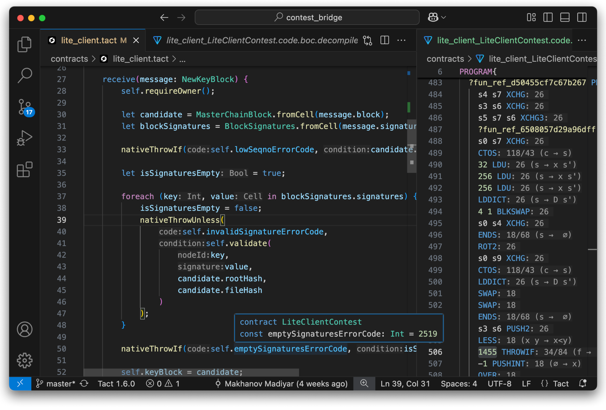

# Tact Language Server

Developed by [TON Studio](https://tonstudio.io), powered by the community.

**[Features] • [Installation] • [Community] • [Troubleshooting]**

[Features]: #features
[Installation]: #installation
[Community]: #community
[Troubleshooting]: #troubleshooting

[](https://x.com/tact_language)
[](https://t.me/tactlang)
[](https://t.me/tact_kitchen)

---

This language server and an extension for VSCode-based editors provide support for the [Tact programming language](https://tact-lang.org).
Tact is a next-generation programming language for building secure, scalable, and maintainable smart contracts on TON blockchain.

## Features

- [Semantic syntax highlighting]
- [Code completion] with [auto import], [postfix completion], snippets, [imports completion]
- Go to [definition], implementation, [type definition]
- Find all references, workspace symbol search, symbol renaming
- Types and documentation on hover
- Inlay hints [for types], [parameter names] and [more]
- On-the-fly inspections with quick fixes
- Signature help inside calls, `initOf` and struct initialization
- [Lenses] with implementation/reference counts
- [Gas estimates] for assembly functions
- Build and test projects based on Blueprint and [Tact template]
- Integration with Tact compiler and Misti static analyzer

[Semantic syntax highlighting]: https://github.com/tact-lang/tact-language-server/blob/master/docs/manual/features/highlighting.md
[Code completion]: https://github.com/tact-lang/tact-language-server/blob/master/docs/manual/features/completion.md
[auto import]: https://github.com/tact-lang/tact-language-server/blob/master/docs/manual/features/completion.md#auto-import
[postfix completion]: https://github.com/tact-lang/tact-language-server/blob/master/docs/manual/features/completion.md#postfix-completion
[imports completion]: https://github.com/tact-lang/tact-language-server/blob/master/docs/manual/features/completion.md#imports-completion
[definition]: https://github.com/tact-lang/tact-language-server/blob/master/docs/manual/features/navigation.md#go-to-definition
[type definition]: https://github.com/tact-lang/tact-language-server/blob/master/docs/manual/features/navigation.md#go-to-type-definition
[for types]: https://github.com/tact-lang/tact-language-server/blob/master/docs/manual/features/inlay-hints.md#type-hints
[parameter names]: https://github.com/tact-lang/tact-language-server/blob/master/docs/manual/features/inlay-hints.md#parameter-hints
[more]: https://github.com/tact-lang/tact-language-server/blob/master/docs/manual/features/inlay-hints.md#additional-hints
[Lenses]: https://github.com/tact-lang/tact-language-server/blob/master/docs/manual/features/code-lenses.md
[Gas estimates]: https://github.com/tact-lang/tact-language-server/blob/master/docs/manual/features/gas-calculation.md
[Tact template]: https://github.com/tact-lang/tact-template

## Quick start

The easiest way to get started with Tact is to use VS Code or editors based on it:

1. Install the Tact language extension
   [in VS Code](https://marketplace.visualstudio.com/items?itemName=tonstudio.vscode-tact)
   or [in VS Code-based editors](https://open-vsx.org/extension/tonstudio/vscode-tact)
2. That's it!



## Installation

### VS Code / VSCodium / Cursor / Windsurf

1. Get the latest `.vsix` file from [releases](https://github.com/tact-lang/tact-language-server/releases) from
   [VS Code marketplace](https://marketplace.visualstudio.com/items?itemName=tonstudio.vscode-tact)
   or from [Open VSX Registry](https://open-vsx.org/extension/tonstudio/vscode-tact)
2. In VS Code:
    - Open the Command Palette (`Ctrl+Shift+P` or `Cmd+Shift+P`)
    - Type "Install from VSIX"
    - Select the downloaded `.vsix` file
    - Reload VS Code

### Other Editors

1. Get the latest archive from [releases](https://github.com/tact-lang/tact-language-server/releases):
    - `tact-language-server-*.tar.gz` for Linux/macOS
    - `tact-language-server-*.zip` for Windows
2. Extract it to a convenient location
3. Configure your editor to use the language server (see editor-specific instructions below)

### Building from Source

If you want to build the language server yourself:

```shell
git clone https://github.com/tact-lang/tact-language-server
cd tact-language-server
yarn install
yarn build
```

To obtain the `.vsix` package with the VS Code extension, additionally run:

```shell
yarn package
```

Then run either of those to install the extension from the `.vsix` package:

```shell
# VSCode, replace VERSION with the actual version from package.json
code --install-extension vscode-tact-VERSION.vsix

# VSCodium, replace VERSION with the actual version from package.json
codium --install-extension vscode-tact-VERSION.vsix
```

## Editor Setup

### Sublime Text

1. Install [LSP](https://packagecontrol.io/packages/LSP) package:

    - Open Command Palette (`Ctrl+Shift+P` or `Cmd+Shift+P`)
    - Select "Package Control: Install Package"
    - Search for and select "LSP"

2. For syntax highlighting, install the [`Tact` package](https://github.com/tact-lang/tact-sublime) via Package Control in a similar manner:

    - Open Command Palette (`Ctrl+Shift+P` or `Cmd+Shift+P`)
    - Select "Package Control: Install Package"
    - Search for and select "Tact"

3. Add the following configuration to your LSP settings (`Preferences > Package Settings > LSP > Settings`):

    ```jsonc
    {
        "clients": {
            "tact": {
                "enabled": true,
                "command": ["node", "path/to/language-server/dist/server.js", "--stdio"],
                "selector": "source.tact",
            },
        },
        "inhibit_snippet_completions": true,
    }
    ```

4. Create a new file with the `.tact` extension to verify the setup

### Neovim

Prerequisites:

- [nvim-lspconfig](https://github.com/neovim/nvim-lspconfig)
- Neovim 0.5.0 or newer

Setup steps:

1. Add `tact.lua` to your `lua/lspconfig/server_configurations` directory with the following content:

    ```lua
    local util = require 'lspconfig.util'

    return {
      default_config = {
        cmd = { 'node', '/absolute/path/to/language-server/dist/server.js', '--stdio' },
        filetypes = { 'tact' },
        root_dir = util.root_pattern('package.json', '.git'),
      },
      docs = {
        description = [[
          Tact Language Server
          https://github.com/tact-lang/tact-language-server
        ]],
        default_config = {
          root_dir = [[root_pattern("package.json", ".git")]],
        },
      },
    }
    ```

2. Add the following to your `init.lua`:

    ```lua
    require'lspconfig'.tact.setup {}
    ```

### Vim

Prerequisites:

- Vim 8 or newer
- Async LSP Client for Vim: [vim-lsp](https://github.com/prabirshrestha/vim-lsp)
- Plugin for Tact: [tact.vim](https://github.com/tact-lang/tact.vim)

Recommended, but not required:

- Auto-configurations for many language servers: [vim-lsp-settings](https://github.com/mattn/vim-lsp-settings)

Setup steps:

1. Install the [tact.vim](https://github.com/tact-lang/tact.vim) if it hasn't already been installed. Use a non-built-in plugin manager to simplify the update process.

2. Install the [vim-lsp](https://github.com/prabirshrestha/vim-lsp) plugin if it isn't already installed. For that, use [vim-plug](https://github.com/junegunn/vim-plug) or the built-in package manager of Vim 8+, see [`:help packages`](https://vimhelp.org/repeat.txt.html#packages).

- If it wasn't installed before, you should set up basic keybindings with the language client. Add the following to your `~/.vimrc` (or `~/_vimrc` if you're on Windows):

    ```vim
    function! s:on_lsp_buffer_enabled() abort
        setlocal omnifunc=lsp#complete
        setlocal signcolumn=yes
        if exists('+tagfunc') | setlocal tagfunc=lsp#tagfunc | endif
        nmap <buffer> gd <plug>(lsp-definition)
        nmap <buffer> gs <plug>(lsp-document-symbol-search)
        nmap <buffer> gS <plug>(lsp-workspace-symbol-search)
        nmap <buffer> gr <plug>(lsp-references)
        nmap <buffer> gi <plug>(lsp-implementation)
        nmap <buffer> gt <plug>(lsp-type-definition)
        nmap <buffer> <leader>rn <plug>(lsp-rename)
        nmap <buffer> [g <plug>(lsp-previous-diagnostic)
        nmap <buffer> ]g <plug>(lsp-next-diagnostic)
        nmap <buffer> K <plug>(lsp-hover)
        nnoremap <buffer> <expr><c-f> lsp#scroll(+4)
        nnoremap <buffer> <expr><c-d> lsp#scroll(-4)

        let g:lsp_format_sync_timeout = 1000
        autocmd! BufWritePre *.rs,*.go call execute('LspDocumentFormatSync')

        " Refer to the doc to add more commands:
        " https://github.com/prabirshrestha/vim-lsp#supported-commands
    endfunction

    augroup lsp_install
        au!
        " call s:on_lsp_buffer_enabled only for languages that have the server registered.
        autocmd User lsp_buffer_enabled call s:on_lsp_buffer_enabled()
    augroup END
    ```

3. Add the following to your `~/.vimrc` (or `~/_vimrc` if you're on Windows):

    ```vim
    if executable('node')
      au User lsp_setup call lsp#register_server({
            \ 'name': 'tact',
            \ 'cmd': {server_info->['node', '/absolute/path/to/language-server/dist/server.js', '--stdio']},
            \ 'allowlist': ['tact'],
            \ })
    endif
    ```

### Helix

1. Add the following configuration to your `~/.config/helix/languages.toml`:

    ```toml
    [[language]]
    name = "tact"
    language-servers = ["tact-language-server"]

    [language-server.tact-language-server]
    command = "node"
    args = ["path/to/language-server/dist/server.js", "--stdio"]
    ```

2. Replace `path/to/language-server` with the actual path where you cloned the repository
3. Restart Helix for changes to take effect

## Community

- [`@tactlang` on Telegram](https://t.me/tactlang) - Main community chat and discussion group.
- [`@tactlang_ru` on Telegram](https://t.me/tactlang_ru) _(Russian)_
- [`@tact_kitchen` on Telegram](https://t.me/tact_kitchen) - Channel with updates from the team.
- [`@tact_language` on X/Twitter](https://x.com/tact_language)
- [`tact-lang` organization on GitHub](https://github.com/tact-lang)
- [`@ton_studio` on Telegram](https://t.me/ton_studio)
- [`@thetonstudio` on X/Twitter](https://x.com/thetonstudio)

## Troubleshooting

See [TROUBLESHOOTING.md](./docs/manual/troubleshooting.md).

# License

MIT
