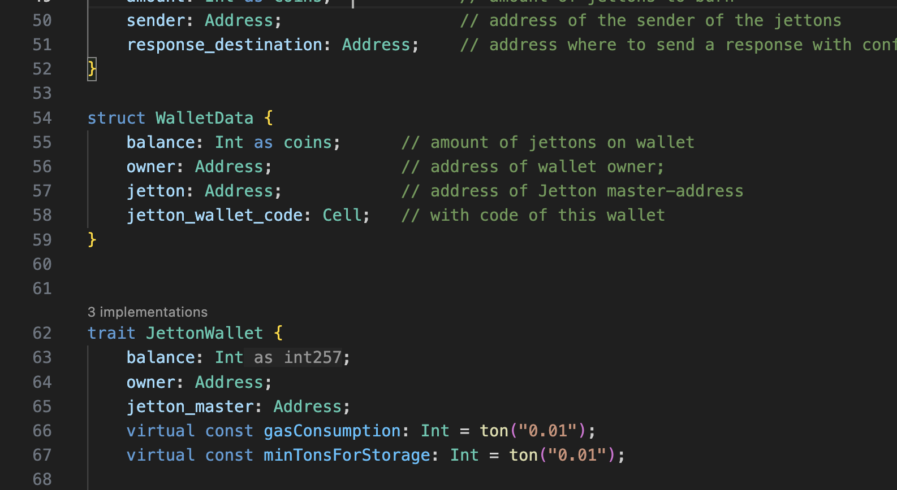

# Code lenses

Language Server provides several locations where special clickable links with information are displayed.

## Traits implementation

Above each trait is displayed the number of contracts or traits that inherit from that trait.

## Go to parent field

If a contract or trait is inherited from another trait with a field, the field must be defined in the contract or trait
itself. A code lens is displayed above such a field for quick navigation to the field in the inherited trait.

## Go to overridden method

If a contract or trait is inherited from another trait with a method, the method can be overridden in the contract or
trait itself. A code lens is displayed above such a method for quick navigation to the method in the inherited trait.

## Go to implementation of abstract method

If an abstract function is defined in a trait, and it is implemented in another trait or contract, then a code lens is
displayed above such a method to quickly navigate to the implementations.

## Go to overrides of virtual method

If a trait defines a virtual function, and it is overridden in another trait or contract, a code lens is displayed
above that method to quickly navigate to the overrides.

