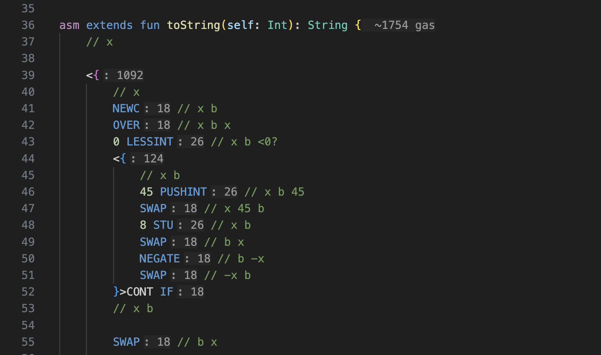

# Gas Calculation

The Language Server provides gas consumption analysis for assembly functions.

Gas consumption information is displayed in two ways:

1. In the documentation when hovering over a function
2. As inline hint after the opening bracket of the function body

## Accuracy

The accuracy of gas calculations depends on the function complexity:

- **Simple functions**: Calculations are quite accurate
- **Complex functions** (with branches and loops): Calculations are approximate

## Calculation Rules

The Language Server uses the following rules to estimate gas consumption:

### Branching (if-else)

- Take the branch with the highest gas consumption
- This provides a "worst-case scenario" estimation

### Loops

- Applies to `while`, `until`, and `repeat` statements
- Gas consumption is calculated as: `loop_body_gas * coefficient`
- Default coefficient is 5
- You can adjust this in VS Code settings:
    - Open **Settings**
    - Search for **"Tact: Editor › Gas Calculation"**
    - Modify **"Loop Gas Coefficient"**

### Unknown Instructions

- Instructions without known gas costs are counted as zero gas
- This might lead to underestimation in some cases

## Tips

- Use these calculations as guidelines rather than exact values

## Disabling Gas Hints

If you don't need gas calculations, you can disable them:

1. Open VS Code **Settings**
2. Search for **"Tact: Editor › Gas Hints"**
3. Disable the relevant options:
    - **"Show Gas Consumption"**: For asm functions
    - **"Show Asm Instruction Gas"**: For individual instructions
    - **"Show Continuation Gas"**: For continuation blocks
