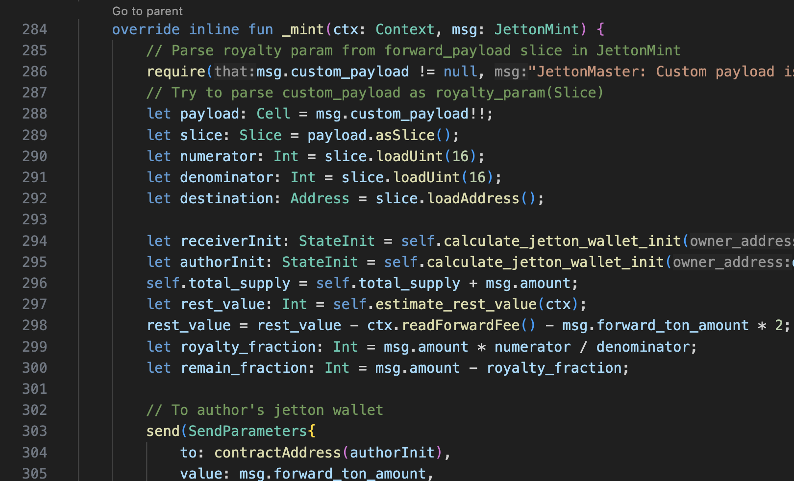
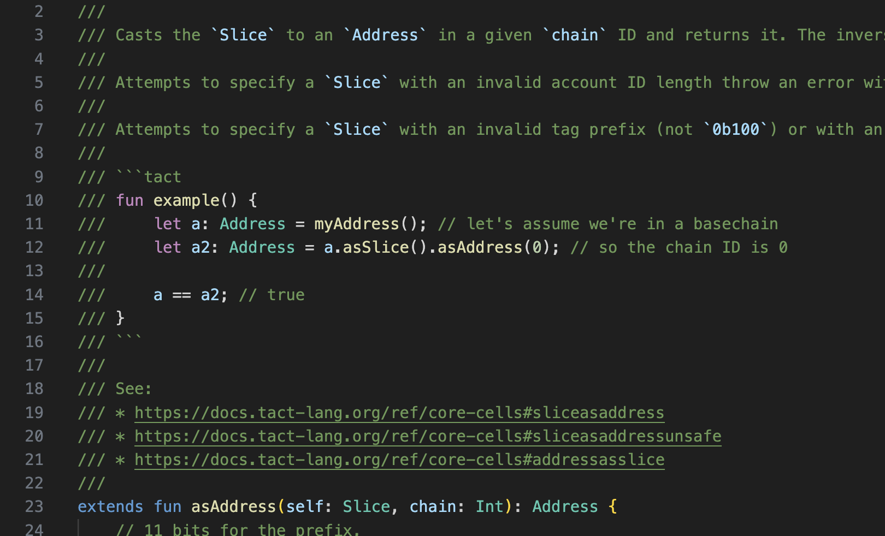

# Highlighting

Language Server provides advanced code highlighting via Semantic Tokens. This highlighting is usually in addition to the
editor highlighting:

LS also additionally highlights code inside doc comments:

