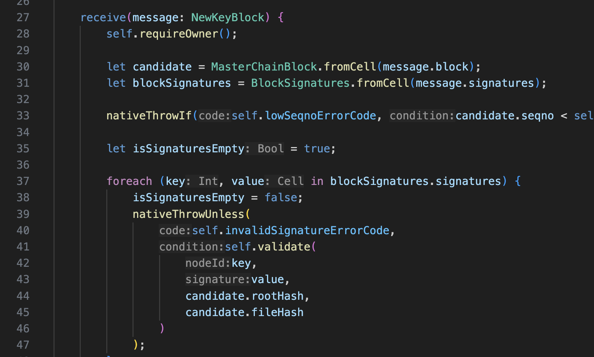
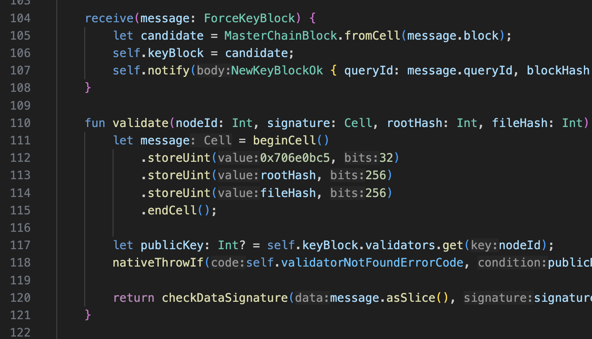
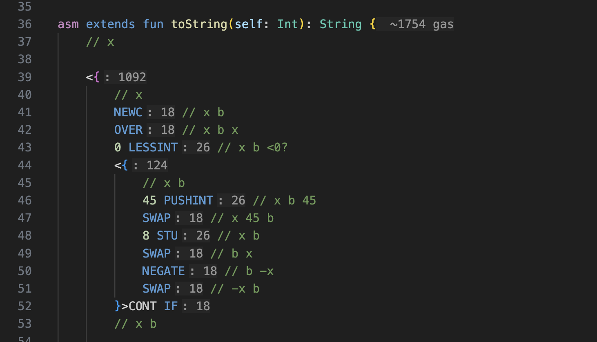
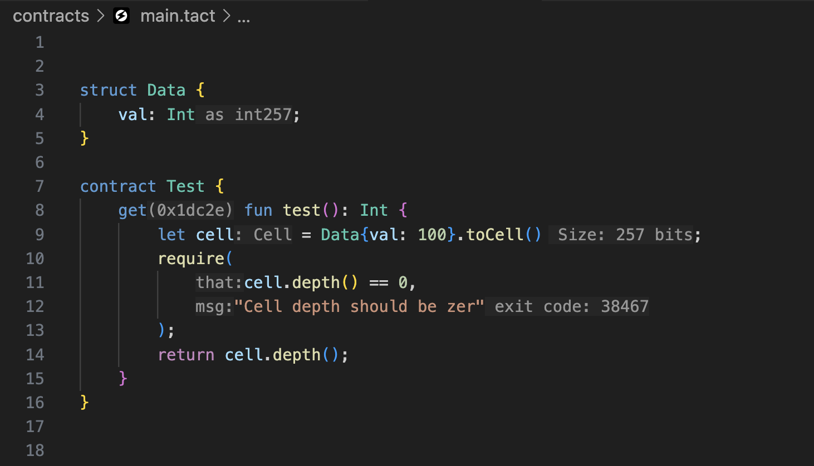

# Inlay Hints

Language Server provides inline hints that appear directly in your code to show additional information. These hints are
clickable and will navigate you to the relevant definition.

## Type Hints

Shows inferred types for variables and expressions where type isn't explicitly specified.

These hints are shown for:

- Variable declarations (`let x = ...`)
- Foreach variables (`foreach (k, v in map)`)
- Catch clause variables

Type hints are not shown when the type is obvious:

- Instance creation (`let params = SomeParams{}`)
- `fromCell` method (`let foo = Foo.fromCell(cell)`)

## Parameter Hints

Shows parameter names at call sites.

Parameter hints are skipped when:

- Parameter name matches argument (`takeFoo(foo)`)
- Argument is a property access matching parameter (`takeFoo(val.foo)`)
- Argument is a function call with name matching parameter (`takeFoo(foo())`)
- Argument is a method call with name matching parameter (`takeFoo(val.foo())`)
- Parameter is a parameter of a well-known unary function like `ton()`
- Parameter name is a single letter

## Gas Consumption Hints

Shows approximate gas costs for:

- Assembly functions (after opening brace)
- Individual assembly instructions
- Continuation blocks

Gas hints include:

- Exact values for simple functions
- Approximate values with "~" prefix for complex functions
- Stack effect for assembly instructions (disabled by default)

Learn more about gas calculation in [Gas Calculation](./gas-calculation.md).

## Additional Hints

- **Exit Codes**: Shows actual exit code values in `require()` calls
- **Method IDs**: Displays getter method IDs in hex format
- **toCell Size**: Shows serialized size for values being converted to cells
- **TL-B Types**: Indicates a default TL-B serialization type for Int fields

## Customization

All hint types can be configured or disabled in VS Code settings:

- **Tact: Editor › Inlay Hints**
- **Tact: Editor › Gas Hints**
- **Tact: Editor › Exit Code Format** (decimal/hex)

## Navigation

Click any hint that references a definition (like type hints or parameter names) to navigate to its declaration.

https://github.com/user-attachments/assets/d4b26194-ff89-4901-a6a0-70546ee12921
